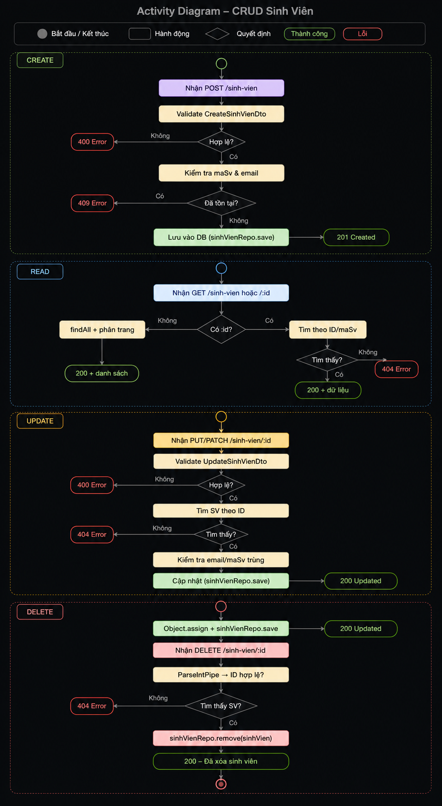

# BÀI KIỂM TRA GIỮA KỲ MÔN LẬP TRÌNH WEB
## Thông tin sinh viên
- Họ và tên: Nguyễn Quốc Khánh
- Framework: NestJS
- Đề tài: Hệ thống Quản lý Sinh viên
# Giới thiệu
Đây là bài kiểm tra giữa kỳ môn Lập trình Web được xây dựng bằng framework **NestJS**.
Phần công việc thực hiện là xây dựng chức năng quản lý **Sinh viên (Student)** với đầy đủ các thao tác **CRUD** kết nối với cơ sở dữ liệu MySQL.
# Chức năng đã thực hiện
Đối tượng thực hiện: **Student**
Các chức năng đã xây dựng:
- Thêm sinh viên (Create)
- Hiển thị danh sách sinh viên (Read)
- Cập nhật thông tin sinh viên (Update)
- Xóa sinh viên (Delete)
# Cấu trúc project
baigk/
│
├── src/
│   ├── students/
│   │   ├── student.entity.ts
│   │   ├── students.controller.ts
│   │   ├── students.service.ts
│   │   ├── students.module.ts
│   │   └── students.controller.spec.ts
│   │
│   ├── app.module.ts
│   └── main.ts
│
├── test/
├── package.json
├── tsconfig.json
├── quanlysinhvien.sql
└── README.md
# Cơ sở dữ liệu
Sử dụng **MySQL**.
File cơ sở dữ liệu:
quanlysinhvien.sql
Import file SQL vào MySQL trước khi chạy chương trình.
# Hướng dẫn cài đặt
Cài đặt các thư viện:
npm install
# Tạo file .env ở thư mục gốc:
# DB_HOST=localhost
# DB_PORT=3306
# DB_USER=root
# DB_PASSWORD=your_password
# DB_NAME=student_management

npm run start:dev
# API đã xây dựng
## Create Student

{
  "maSv": "SV005",
  "hoTen": "Nguyễn Thị Lan",
  "ngaySinh": "2003-07-15",
  "gioiTinh": "Nữ",
  "email": "lan.nt@student.edu.vn",
  "soDienThoai": "0945678901",
  "diaChi": "Hoàn Kiếm, Hà Nội",
  "lopHocId": 1,
  "trangThai": "Đang học"
}

{
  "statusCode": 201,
  "message": "Tạo sinh viên thành công",
  "data": { "id": 5, "maSv": "SV005", ... }
}
## Read Student
Lấy danh sách (có phân trang, tìm kiếm):

GET /sinh-vien?search=Lan&trangThai=Đang học&page=1&limit=10

Lấy chi tiết theo ID:

GET /sinh-vien/5

Lấy theo mã SV:

GET /sinh-vien/ma/SV005

Response 200: trả về data, total, page, totalPages.

## Update Student
Cập nhật toàn bộ: PUT /sinh-vien/5

Cập nhật một phần: PATCH /sinh-vien/5
{
  "soDienThoai": "0999888777",
  "trangThai": "Tạm dừng"
}

## Delete Student
DELETE /students/:id
{
  "statusCode": 200,
  "message": "Đã xóa sinh viên \"Nguyễn Thị Lan\" (SV005)"
}
### Activity Diagram

